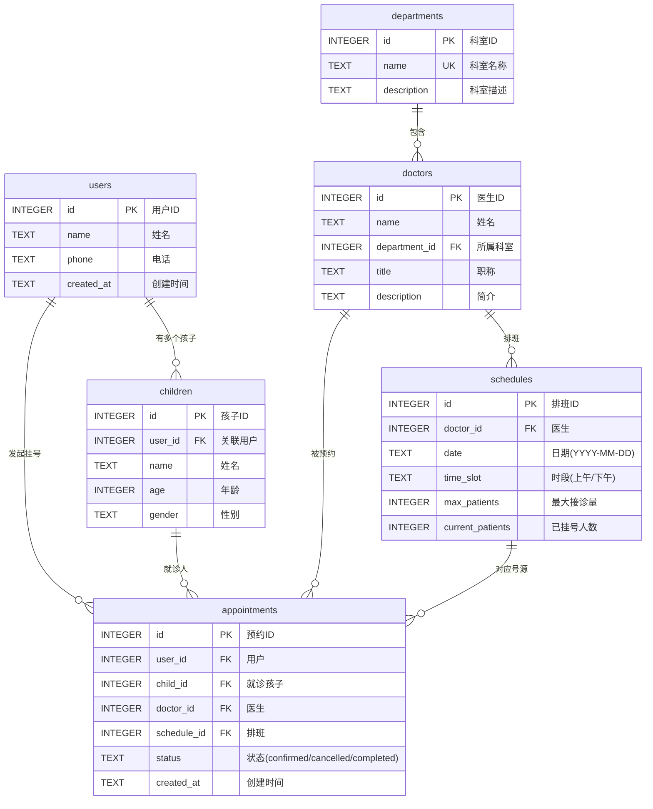
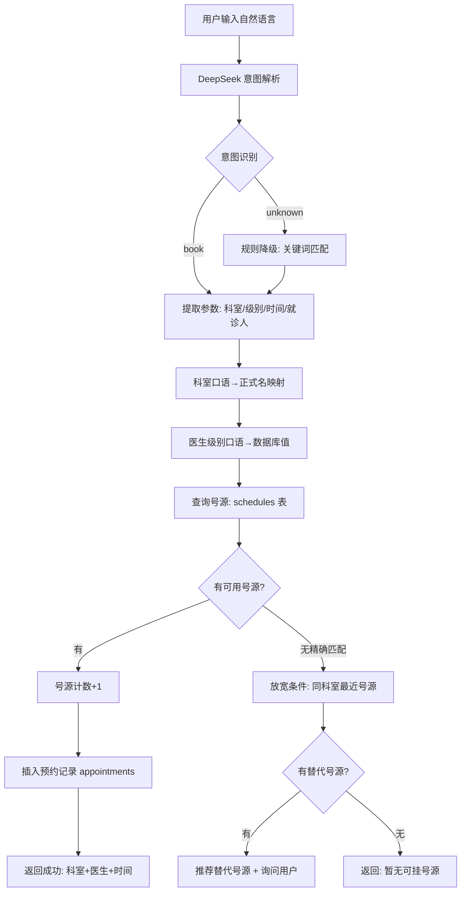
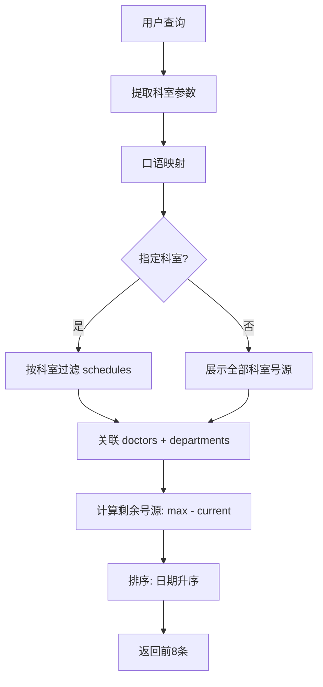
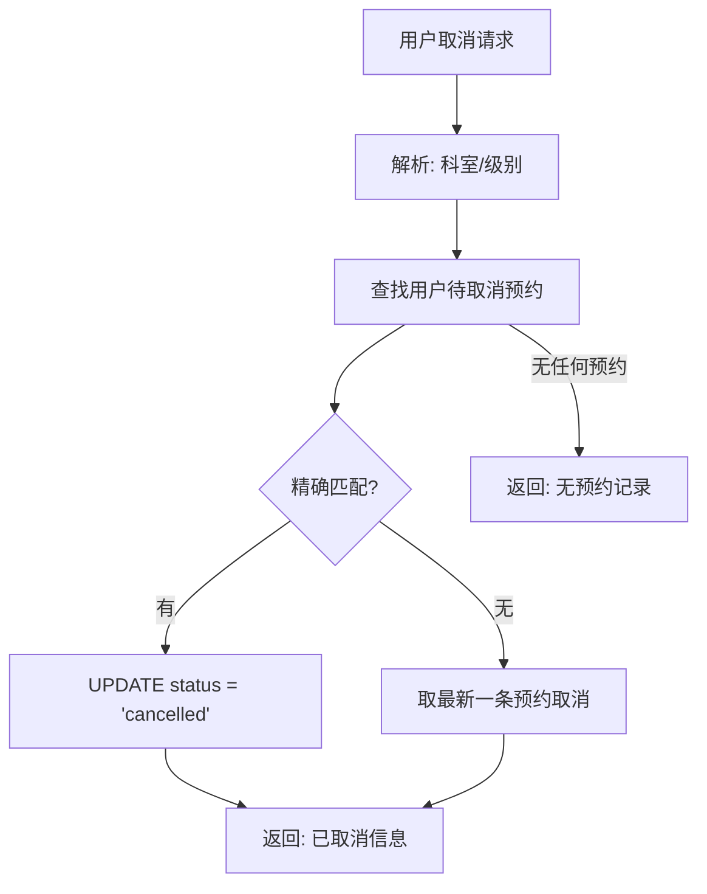
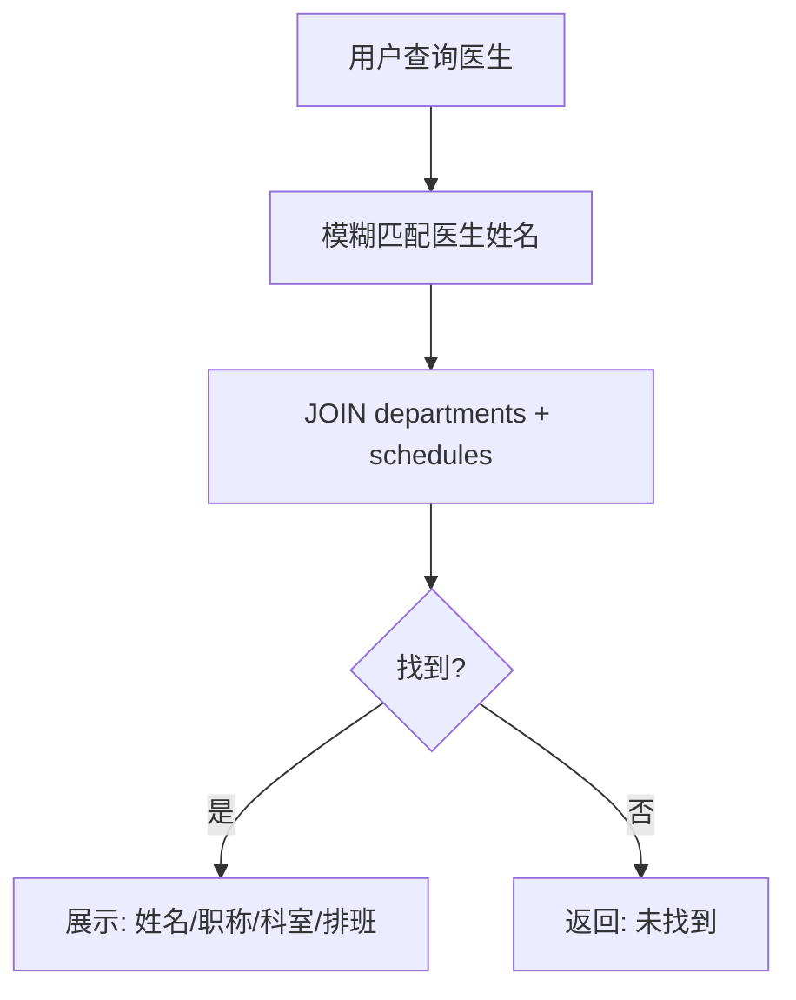
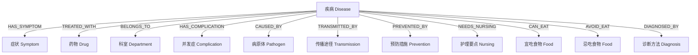

# 挂号管理系统 - ER 图 & 业务流程图

**工单编号：** 人工智能 NLP-Agent 数字人项目-医疗智能体-挂号管理 V1.1

---

## 1. 实体关系图 (ER Diagram)

## 2. 挂号业务流程图

### 2.1 挂号流程 (Book Appointment)

### 2.2 号源查询流程 (Query)

### 2.3 取消挂号流程 (Cancel)

### 2.4 医生查询流程 (Doctor Query)

## 3. Neo4j 知识图谱图模型

## 4. 数据库表关系说明

| 关系 | 类型 | 说明 |
|------|------|------|
| users → children | 1:N | 一个用户可有多个孩子 |
| users → appointments | 1:N | 一个用户可多次挂号 |
| departments → doctors | 1:N | 一个科室有多位医生 |
| doctors → schedules | 1:N | 一个医生有多个排班时段 |
| schedules → appointments | 1:N | 一个号源对应多个预约(最多max_patients个) |
| doctors → appointments | 1:N | 一个医生被多次预约 |
