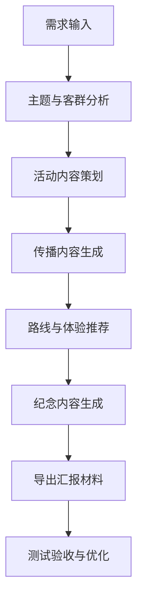

# 西安秦风沉浸夜游完整方案包

## 1. 基本信息
- 主题：秦风沉浸夜游
- 城市：西安
- 地区：西北
- 景点：兵马俑
- 目标人群：年轻游客
- 时长：1天
- 预算：中等预算
- 关键词：历史、夜游、互动

## 2. 策划定位
这是一个以秦风沉浸夜游为核心、依托兵马俑场景、服务于年轻游客的文旅策划方案。

## 3. 策划长文
# 文旅活动策划方案：秦风沉浸夜游

## 一、主题定位

**主题名称**：秦风沉浸夜游——穿越千年的帝国军阵

**核心概念**：以秦始皇陵兵马俑为核心IP，打造一场结合历史叙事、光影科技与互动体验的沉浸式夜游活动。通过“夜探秦陵”的形式，将兵马俑从静态文物转化为动态故事，让年轻游客在夜色中感受秦帝国的磅礴气势与神秘氛围。

**补全假设**：假设兵马俑景区已具备夜间开放条件，并设有光影装置、互动体验区及文创市集等配套设施。活动时间为夏季傍晚至夜间（18:00-22:00），以避开白天高温并提升夜游体验。

## 二、目标客群

- **核心人群**：18-35岁年轻游客，包括大学生、职场新人、自由行爱好者。
- **次核心人群**：历史爱好者、短视频创作者、亲子家庭（以研学为目的）。
- **客群特征**：追求沉浸式、互动性强、适合拍照打卡的体验；对历史故事有好奇心，但拒绝枯燥讲解；偏好社交分享与短视频传播。

## 三、活动内容

### 1. 活动主线：秦军夜巡·帝国幻境

- **开场仪式（18:00-18:30）**：在景区入口设置“秦军点兵”仪式，由演员扮演秦军士兵，击鼓鸣号，引导游客“入城”。游客领取“秦军令牌”（手环或卡片），作为互动凭证。
- **光影沉浸展（18:30-20:00）**：在兵马俑一号坑、二号坑区域，利用3D投影、激光灯效与声效，还原秦军列阵、战车冲锋、工匠铸造等场景。游客佩戴AR眼镜或通过手机小程序，可看到兵马俑“复活”并演绎历史片段。
- **互动解密游戏（20:00-21:00）**：以“寻找秦帝国密令”为线索，游客在景区内寻找隐藏的NPC（身着秦代服饰的演员），完成问答、拼图、射箭等任务，解锁“秦军密令”并兑换文创奖品。
- **夜光市集与文创体验（21:00-22:00）**：在景区广场设置“秦市夜集”，售卖兵马俑主题文创（如夜光俑手办、秦纹丝巾）、特色小吃（如秦式烤肉、凉皮）。设有“陶俑手作”工坊，游客可亲手制作迷你兵马俑并带走。

### 2. 特色亮点

- **“复活”兵马俑**：通过AR技术与真人演员结合，让游客与“秦军士兵”合影、互动，甚至参与“军阵演练”。
- **夜光打卡点**：在景区关键位置设置“秦陵星图”灯光装置，游客可拍摄“置身秦军阵中”的创意照片。
- **声音剧场**：在二号坑区域，利用定向音响播放秦代战争音效（马蹄声、号角声、兵器碰撞声），增强沉浸感。

## 四、流程安排

| 时间 | 环节 | 地点 | 内容 |
|------|------|------|------|
| 18:00-18:30 | 开场仪式 | 景区入口 | 秦军点兵、令牌发放、引导入城 |
| 18:30-20:00 | 光影沉浸展 | 一号坑、二号坑 | AR体验、光影演绎、声效剧场 |
| 20:00-21:00 | 互动解密游戏 | 景区全域 | NPC互动、任务挑战、奖品兑换 |
| 21:00-22:00 | 夜光市集与文创体验 | 景区广场 | 市集购物、手作工坊、自由打卡 |

## 五、传播建议

### 1. 预热期（活动前2周）
- **短视频挑战赛**：在抖音、小红书发起#秦风夜游挑战#，邀请用户发布“兵马俑复活”创意视频，优秀作品可获得活动门票。
- **KOL合作**：邀请历史类、旅行类博主探访活动筹备现场，发布“夜游预告”内容，制造悬念。

### 2. 活动期（活动当天）
- **直播互动**：在抖音、B站直播活动亮点（如光影展、NPC互动），设置“云游”抽奖，吸引线上观众。
- **打卡激励**：游客在社交媒体发布活动照片并带话题#秦风沉浸夜游#，可在市集兑换免费文创。

### 3. 长尾期（活动后1周）
- **用户UGC二次传播**：收集用户发布的优质内容，制作“活动精彩回顾”短视频，在官方账号发布。
- **口碑营销**：在携程、马蜂窝等平台引导用户撰写活动体验，提升后续活动吸引力。

## 六、预算提示（中等预算，约50-80万元）

| 项目 | 预算占比 | 说明 |
|------|----------|------|
| 光影设备与技术支持 | 40% | AR眼镜租赁、投影设备、灯光系统 |
| 演员与NPC团队 | 20% | 秦军士兵、工匠、NPC演员（约30人） |
| 文创产品与奖品 | 15% | 令牌、夜光手办、手作材料包 |
| 市集搭建与场地布置 | 15% | 灯光装置、摊位搭建、氛围装饰 |
| 传播与营销 | 10% | KOL合作、直播推广、平台投放 |

**预算弹性建议**：若预算紧张，可缩减光影设备规模（如仅使用手机AR小程序替代专业设备），或减少演员数量（NPC改为固定点位互动）。

## 七、风险提醒

| 风险类型 | 具体问题 | 应对措施 |
|----------|----------|----------|
| 天气风险 | 夏季夜间可能有降雨 | 准备备用室内场地（如博物馆大厅）；提供雨具租赁；活动前3天关注天气预报，必要时延期 |
| 安全风险 | 夜间游览人流密集，易发生踩踏 | 设置单向游览动线；增加安保人员与指引标识；控制单场活动人数（建议不超过2000人） |
| 文物安全 | 光影设备可能对文物造成影响 | 提前与文物管理部门沟通，确保设备不接触文物；使用低热量、无紫外线光源；设置隔离区域 |
| 技术风险 | AR设备故障或网络延迟 | 准备备用设备；提前测试网络覆盖；提供线下替代方案（如纸质地图+NPC引导） |
| 舆情风险 | 游客对“夜游”体验期望过高 | 在宣传中明确活动内容与限制（如部分区域不开放）；设置现场反馈渠道，及时处理投诉 |

## 八、落地建议

1. **前期合作**：与西安文旅局、秦始皇陵博物院沟通，获取夜间开放许可与文物安全指导。
2. **测试场次**：活动前进行1-2场小规模测试（邀请本地游客或媒体），优化流程与互动环节。
3. **票务策略**：设置早鸟票（提前购票享8折）、学生票（半价）、家庭套票（2大1小优惠），通过大麦网、美团等平台销售。
4. **交通配套**：与当地公交公司合作，开设“夜游专线”从市区直达景区；提供免费接驳车往返停车场。

---

**备注**：本方案基于“兵马俑景区具备夜间开放条件”的假设补全，实际落地需根据景区政策、文物保护要求及天气情况调整。如需进一步细化某一环节（如互动游戏设计或传播内容），可提供更详细方案。

## 4. 核心亮点
- 围绕秦风沉浸夜游打造沉浸式体验主线
- 结合兵马俑在地文化做差异化表达
- 面向年轻游客设计传播与消费转化路径

## 5. 活动流程
- 主题开场：用故事化方式引入秦风沉浸夜游价值。
- 核心体验：设置互动打卡、文化解读、创意演绎等关键环节。
- 传播扩散：结合社交媒体话题、UGC 征集与短视频素材产出。

## 6. 传播内容
好的，收到您的需求。基于您提供的“秦风沉浸夜游”主题和西安兵马俑的文旅知识，我将为您量身定制一套结构化、可落地的文旅传播内容方案。

**补全假设说明：** 由于您未提供具体场地限制，我假设夜游活动在“秦始皇帝陵博物院”外围特定区域（如已开放的“秦陵文化景区”或规划中的夜游体验区）或与景区合作的室内外沉浸式剧场进行。时间设定为1天，中等预算，目标人群为18-35岁年轻游客。

---

### 一、文旅传播内容总方案

#### 1. 宣传标题

*   **主标题：** 《夜探秦陵：当兵马俑“醒”来，与千年帝国共赴一场暗夜之约》
*   **副标题：** 西安·秦风沉浸夜游 | 触摸历史脉搏，解锁兵马俑的B面传奇
*   **备选标题：** 《别只白天看俑！夜晚的秦陵，才是你穿越千年的入口》

#### 2. 亮点文案（核心卖点）

*   **【视觉震撼】** 灯光科技赋能，千尊陶俑在夜色中“苏醒”，光影流转间重现秦军列阵的磅礴气势。
*   **【互动破圈】** 手持“虎符”令牌，通过AR扫描触发隐藏剧情，与“秦俑将军”对话，破解军阵密码。
*   **【沉浸仪式】** 穿秦服、执戈矛、听号角，在模拟的“秦直道”上完成一次“帝国巡逻”，体验“赳赳老秦”的豪迈。
*   **【文化彩蛋】** 夜游专属“秦简盲盒”，内含仿古竹简书写的秦朝小知识或趣味签文，带回家一份独一无二的“秦代记忆”。

#### 3. 社交媒体短文案（适配小红书/抖音）

*   **文案A（小红书风格）：**
    > 🌙 西安夜游新玩法！我在兵马俑里“穿越”了！
    > 白天看俑是震撼，晚上看俑是“诡异”又上头！😱
    > 手持虎符，夜探秦陵，灯光一打，感觉俑哥们下一秒就要开口说话！
    > 📸 拍照绝了！光影交错，分分钟出大片！还穿上了秦朝战袍，感觉自己就是大将军！
    > 强推“秦简盲盒”，抽到了“商鞅变法”的签文，太酷了！
    > #西安旅游 #兵马俑夜游 #沉浸式体验 #城市夜生活 #穿越

*   **文案B（抖音风格）：**
    > 兵马俑晚上不闭馆？进去会发生什么？🔥
    > 带上你的“虎符”，解锁隐藏剧情！
    > 跟秦俑将军对暗号，在秦直道上跑一圈，这体验绝了！
    > 谁说历史很无聊？来夜游秦陵，你就是主角！
    > 点赞收藏，晚上就去打卡！@你的特种兵搭子
    > #兵马俑 #夜游西安 #沉浸式 #特种兵旅游 #国潮

#### 4. 短视频脚本（30-60秒，适配抖音/视频号）

**脚本标题：** 《虎符在手，夜闯秦陵》

| 镜头序号 | 画面描述 | 音效/旁白 | 字幕/特效 |
| :--- | :--- | :--- | :--- |
| 1 | **【开场】** 夜幕下的秦陵博物院外景，灯光勾勒出雄伟轮廓。 | **音效：** 低沉鼓声 + 风声 | 字幕：西安·秦风沉浸夜游 |
| 2 | **【悬念】** 主角手持“虎符”令牌，推开一扇古铜色大门。 | **旁白：** “你以为兵马俑只有白天能看？” | 特效：虎符发光，门上有符文闪烁 |
| 3 | **【高潮】** 镜头转场内：千尊陶俑在蓝色/金色灯光下“苏醒”，阵列整齐。主角与一位“秦俑将军”（NPC演员）互动。 | **音效：** 战鼓擂动 + 号角声 **对话：** 将军：“来者何人？出示虎符！” 主角：“奉诏而来！” | 字幕：解锁隐藏剧情 |
| 4 | **【体验】** 主角穿上秦甲，在光影投射的“秦直道”上奔跑，AR特效显示战车、旗帜跟随。 | **音效：** 马蹄声 + 风声 **旁白：** “跑一次秦直道，做一回大秦人。” | 特效：AR数字战车、旗帜叠加 |
| 5 | **【结尾】** 主角在“秦简盲盒”前抽取一支竹简，惊喜展示。镜头拉远，全景展示夜游人群与灯光。 | **音效：** 轻松古风BGM **旁白：** “带走你的秦代记忆，今晚，你也是历史的一部分。” | 字幕：夜探秦陵，等你来战！ |

#### 5. 主持人口播词（适用于景区广播、直播或活动开场）

**场景：** 夜游活动开场前，主持人站在秦陵文化广场或入口处。

**口播词（激情、有代入感）：**

“各位朋友，晚上好！欢迎来到‘秦风沉浸夜游’的现场！

白天，我们仰望的是历史的遗迹；但今夜，我们将走进历史的脉搏！请举起你手中的虎符令牌，它不仅是通行证，更是你穿越两千年的钥匙。

看，灯光亮起，千年前的军阵正在苏醒！听，战鼓擂动，那是大秦帝国的召唤！

今晚，你不是游客，你是秦军的一员。请跟随光影的指引，与将军对话，在秦直道上奔跑，去解开那道只属于夜晚的帝国密码。

准备好了吗？让我们一同——夜探秦陵，梦回大秦！”

---

### 二、落地建议（针对中等预算、1天行程）

1.  **场地选择与动线规划：** 建议利用博物院外围的“秦陵文化景区”或与景区合作的室内外空间，设计一条“入口换装（虎符领取）→ 光影阵列 → 互动剧场（对话将军）→ 沉浸步道（秦直道AR体验）→ 文创盲盒出口”的闭环动线。控制总时长约1.5-2小时，避免夜间疲劳。
2.  **技术实现：** 采用轻量级AR技术（手机扫码即可触发），配合固定点位灯光装置和NPC真人互动。中等预算下，优先保证1-2个核心互动场景（如“虎符验证”、“将军对话”）的沉浸感，而非全区域覆盖。
3.  **内容节奏：** 1天行程建议：白天参观兵马俑常规陈列（上午），下午休息或逛周边文创市集，傍晚6点开始夜游活动，8点结束。夜游活动需设置明确的“开始”和“高潮”节点，如开场仪式、将军现身等。
4.  **传播前置：** 在社交平台提前发布“虎符”预热海报，设置“夜游秦陵”话题挑战，鼓励游客在夜游过程中拍摄“与俑合影”的创意视频，并设置“最佳穿越者”奖励（如免费夜游门票或秦简盲盒）。
5.  **安全与体验平衡：** 夜间活动需加强安保和照明，确保游客安全。同时，建议控制每批入场人数（如每批30-50人），避免拥挤破坏沉浸感。可为游客提供一次性“秦袍”披风（低成本道具），增强仪式感。

## 7. 路线推荐
好的，收到您的需求。基于您提供的“秦风沉浸夜游”主题、西安兵马俑、年轻游客、1天中等预算等核心信息，我将为您策划一份结构清晰、可落地的文旅方案。

---

### **文旅方案：秦风沉浸夜游 · 一日穿越计划**

**补全假设说明**：本方案假设目标年轻游客群体（18-35岁）对“沉浸式体验”、“剧本杀”、“国潮文化”、“社交分享”有高度兴趣，且不满足于传统的“白天看坑、晚上看灯”模式。因此，方案核心将围绕“白天深度研学+夜间沉浸体验”进行设计，并引入“角色扮演”和“数字互动”元素。

---

### **一、 主题与核心理念**

*   **主题名称**：**《秦俑密令：帝国最后的夜巡》**
*   **核心理念**：打破时空界限，让游客化身为秦始皇麾下的“暗夜卫队”，在夜幕降临后，通过解谜、探秘、互动，亲历大秦帝国的军阵威严与地下王国的秘密。将严肃的历史知识转化为一场可参与、可分享的沉浸式游戏。

### **二、 目标人群**

*   **核心人群**：18-35岁，喜爱“剧本杀”、“密室逃脱”、“国潮文化”、“短视频拍摄”的年轻游客、大学生、都市白领。
*   **次核心人群**：对历史有浓厚兴趣，追求新鲜体验的“历史爱好者”和“Z世代亲子家庭”（建议孩子8岁以上）。

### **三、 玩法与体验流程（1日安排）**

**体验顺序：上午深度研学 → 下午自由探索与换装 → 傍晚沉浸式夜游**

| 时间段 | 活动内容 | 体验亮点 | 时间安排 |
| :--- | :--- | :--- | :--- |
| **上午 (09:00-12:00)** | **【秦俑密令·白昼篇】**  1. 在兵马俑博物馆门口领取专属“暗夜令牌”（内含NFC芯片，用于激活后续互动）。 2. 跟随专业讲解员（而非普通导游）进行“解谜式”参观。讲解员会抛出多个历史谜题（如：将军俑的铠甲与普通士兵有何不同？），答案隐藏在文物细节中。 | 1. **任务驱动**：不再是枯燥的听讲，而是带着问题去“寻宝”。 2. **专业深度**：讲解员需经过“沉浸式话术”培训，语言风格更贴近年轻人。 | 3小时 |
| **中午 (12:00-14:00)** | **【大秦食肆】**  1. 在景区内或附近指定的“秦文化主题餐厅”用餐。 2. 品尝“秦式套餐”（如：biangbiang面、肉夹馍、凉皮，并配以仿古食器）。 3. 餐厅内设置“军情传递”互动区，可在此获取夜间任务的额外线索。 | 1. **文化味蕾**：体验地道的关中美食。 2. **线索补充**：午餐成为游戏环节的有机组成部分。 | 2小时 |
| **下午 (14:00-17:00)** | **【帝国工坊·自由探索】**  1. **可选A（动手体验）**：在兵马俑文创体验中心，亲手制作一个迷你兵马俑泥塑，或体验“秦小篆”书写。 2. **可选B（换装变身）**：前往景区附近的“秦装体验馆”，租赁一套秦代武士或文官服饰，为夜游做准备。 | 1. **深度参与**：从“看客”变为“创造者”。 2. **颜值经济**：换装是年轻人拍照、发朋友圈的绝佳素材。 | 3小时 |
| **傍晚 (17:00-18:00)** | **【集结号角】**  1. 所有报名夜游的游客在博物馆特定区域集合。 2. 佩戴好“暗夜令牌”，领取“夜巡任务卡”（一张羊皮纸风格的解密地图）。 3. 夜游领队（身着秦军铠甲）进行简短的“出征仪式”。 | **仪式感拉满**：从白天到黑夜的转换，情绪被瞬间点燃。 | 1小时 |
| **夜间 (18:00-21:00)** | **【秦俑密令·夜巡篇】**  1. **核心玩法**：在兵马俑一号坑、二号坑的特定开放区域（灯光昏暗，氛围感强），根据任务卡和“暗夜令牌”的指引，寻找隐藏的“军令符”。 2. **互动触发**：每找到一处“军令符”，令牌会震动并播放一段秦代军阵的音效或一段历史解说。 3. **高潮环节**：在特定点位，利用AR技术，手机屏幕中会浮现出“兵马俑复活”的虚拟影像，与游客进行互动（如：向你行军礼、发出指令）。 4. **最终任务**：集齐所有“军令符”后，在出口处完成“帝国封印”，获得专属的“秦俑密令·夜巡成功”数字证书与实体勋章。 | 1. **沉浸式夜游**：区别于普通灯光秀，是真正的“故事+科技+互动”。 2. **社交货币**：全程可拍照、录视频，AR影像自带话题性。 3. **小团制**：每团限制20人，保证体验质量。 | 3小时 |

### **四、 核心亮点**

1.  **“白+黑”双模式**：白天是知识的“输入”，晚上是体验的“输出”，形成完整的叙事闭环。
2.  **“令牌+NFC+AR”技术融合**：用实体道具（令牌）连接线上（AR、音效）与线下（解谜、寻宝），打造无缝的沉浸感。
3.  **“角色扮演”驱动**：游客不再是旁观者，而是故事中的“暗夜卫队”成员，参与感和使命感极强。
4.  **“社交分享”优先**：所有环节（换装、AR互动、证书）都设计为“可拍照、可发圈”的素材，自带传播属性。

### **五、 传播策略**

*   **短视频平台（抖音/小红书）**：
    *   **话题挑战**：#秦俑密令夜巡 #兵马俑复活夜 #西安沉浸式夜游
    *   **内容方向**：发布“AR兵马俑向你敬礼”的魔性视频；发布“夜巡任务卡”的开箱视频；发布身穿秦装、手持令牌的帅气/飒爽打卡照。
    *   **KOL/KOC合作**：邀请西安本地或旅游类KOL免费体验，产出高质量种草内容。
*   **OTA平台（美团/携程/飞猪）**：
    *   **产品包装**：将“夜游”作为独立产品上线，标题突出“沉浸式”、“剧本杀”、“AR互动”等关键词。
    *   **用户评价**：引导体验后的游客发布带图评价，并给予小额优惠券或文创小礼品作为激励。
*   **私域流量**：建立“秦俑密令”粉丝群，定期发布历史冷知识、幕后花絮，并预告下一期活动。

### **六、 落地与执行建议**

1.  **合作模式**：建议由兵马俑景区官方牵头，与专业的沉浸式体验策划公司、AR技术公司、剧本杀工作室三方合作，共同开发。
2.  **安全与文物保护**：
    *   夜游路线必须严格限定在景区已开放的、且经过安全评估的区域。
    *   所有互动设备（如令牌）需使用低功耗、无辐射的材质，严禁对文物产生任何影响。
    *   夜游期间，需配备不少于1:10的安保与工作人员。
3.  **人员培训**：对讲解员、夜游领队、换装馆工作人员进行系统性培训，统一话术和风格，确保“沉浸感”不被打断。
4.  **成本控制**：
    *   **门票**：夜游票可单独定价（建议比白天门票高50%-80%），作为高附加值产品。
    *   **技术投入**：AR与NFC系统可一次性开发，后续复用成本极低。
    *   **物料**：令牌、任务卡等可设计为可循环使用的环保材质，降低单次成本。

### **七、 消费提示**

*   **费用构成**：建议套餐价（含白天门票+午餐+夜游体验+令牌/证书）约为 **500-800元/人**（中等预算）。换装、泥塑体验为自选付费项目。
*   **预订方式**：需提前1-3天在官方小程序或合作OTA平台实名预约，每日限流200人。
*   **穿着建议**：建议穿着舒适的运动鞋，夜间温差大，需带一件外套。如选择换装，建议穿着轻便、易穿脱的秦装。
*   **注意事项**：夜游过程中禁止使用闪光灯拍照，禁止触碰任何文物。

## 8. 纪念内容
好的，收到您的需求！作为您的文旅创意策划助手，我将基于“秦风沉浸夜游”这一主题，结合西安兵马俑的强历史符号和年轻游客的目标人群，为您打造一套结构完整、可落地的文旅纪念内容方案。

**补全假设说明**：由于您未提供具体夜游活动的细节，我假设该夜游项目为“兵马俑博物馆夜间限定开放 + 声光电沉浸式光影秀 + 角色扮演互动解谜”的组合形式，旨在打造一个不同于白天的、神秘而震撼的秦文化体验。

以下是为您生成的具体方案：

---

### **一、 明信片寄语**

**主题：穿越千年的回响**

*   **正面画面描述**：采用水墨风格，勾勒出在幽蓝色夜光下，一尊兵马俑将军俑的半身像，其眼神在光影的映照下仿佛闪烁着智慧与坚毅的光芒。背景是若隐若现的秦军战旗与星辰。
*   **寄语文案（可选其一）**：
    1.  **（深情款款版）** “在夜的沉默里，我听见了千年前的号角。你不再是冰冷的陶俑，而是我今夜最震撼的相遇。从西安带回这份‘秦’缘，愿你我，都能如这军阵般，无畏向前。”
    2.  **（酷炫潮流版）** “打卡了！在兵马俑的‘夜场’，和两千年前的‘兵哥哥’们合了个影。这波沉浸式体验，够硬核！寄给你这份来自大秦的‘邀请函’，下次一起来‘穿越’。”
    3.  **（文艺哲思版）** “当灯光熄灭，星辰亮起，历史在这里苏醒。每一道刻痕，都是时间的低语。我在此刻，与一个帝国对视。愿这封明信片，能带给你片刻的宁静与力量。”

### **二、 纪念海报标题**

**主题：夜·秦风**

*   **主标题**：**《秦·夜未央》**
*   **副标题**：**“光影之下，与帝国共舞”**
*   **说明**：“未央”一词既指夜未尽，也寓意秦帝国未尽的辉煌与秘密，贴合夜游的神秘感与历史厚度。
*   **备选标题**：
    *   《俑·醒》
    *   《穿越时空的对话：兵马俑夜游记》
    *   《西安夜未眠·大秦密码》

### **三、 电子相册封面文案**

**主题：我的秦时明月**

*   **封面图片**：一张游客手持“秦军令牌”造型的夜光手环，站在光影交织的兵马俑一号坑前，背景是动态投射的“秦”字篆书光影。
*   **封面文案**：
    *   **主文案**：**“今夜，我是秦朝人。”**
    *   **副文案**：**“——解锁兵马俑的B面人生”**
*   **相册内页文案建议**：
    *   “光影流转，历史触手可及。”
    *   “与两千年前的军团，完成一次无声的击掌。”
    *   “在解谜中，读懂一个帝国的野心与浪漫。”

### **四、 虚拟合影创意提示词**

**提示词（供AI图像生成工具使用）**：

*   **提示词**：
    > 一张极具电影感的夜间合影照片。一位穿着现代潮流服饰（如卫衣+工装裤）的年轻中国女性，站在西安兵马俑博物馆一号坑的夜游光影现场。她身旁，一尊高大的兵马俑将军俑正“活”了过来，它从队列中微微侧身，用陶土质感的手掌，轻轻搭在女孩的肩上。背景是幽蓝色与琥珀色交织的激光束，投射出“秦”字篆书与战马奔腾的动态光影。兵马俑的铠甲在冷光下反射出金属质感，女孩的脸上是惊喜与敬畏交织的表情。照片风格：超现实主义，电影级光影，细节丰富，构图充满张力。

*   **提示词解析**：通过“现代人”与“活过来的俑”的互动，制造强烈的视觉反差与故事感，完美契合“沉浸式夜游”和“年轻游客”的打卡需求。

### **五、 社交分享文案**

**主题：朋友圈/小红书/抖音 爆款文案**

*   **文案一（小红书/朋友圈，图文类）**：
    > **标题**：谁懂啊！在兵马俑的夜场，我被“将军”搭肩了！🫣
    > **正文**：西安，你还有多少惊喜是我不知道的！白天看兵马俑是震撼，晚上来是直接“穿越”啊！🌙
    > 整个博物馆被光影重新解构，那种神秘感和压迫感，比白天强十倍！感觉自己真的走进了《秦颂》的电影里。🎬
    > 最绝的是那个沉浸式解谜游戏，拿着令牌找线索，最后和“活”过来的将军俑合影，这一刻，历史真的被触动了。❤️
    > #西安旅游 #兵马俑 #夜游西安 #沉浸式体验 #秦风 #旅游打卡 #此生必去

*   **文案二（抖音，短视频类）**：
    > **标题**：当兵马俑在夜里“苏醒”……😱
    > **BGM建议**：宏大的交响乐 + 低沉的战鼓声，最后转为电子音乐高潮。
    > **视频文案**：
    > （画面：黑暗中，一束光打亮一尊兵马俑的脸）
    > 旁白：“他们在这里，沉睡了两千多年。”
    > （画面切换：游客手持令牌，光影在俑坑中流动）
    > 旁白：“但今夜，他们‘醒’了。”
    > （画面：AI生成的“虚拟合影”效果）
    > 旁白：“这是我与帝国的一次对视。”
    > 字幕：“西安·兵马俑夜游，你敢来吗？”

*   **文案三（微博/朋友圈，短平快类）**：
    > 西安兵马俑的夜场，打开了新世界的大门！不是简单的亮灯，是沉浸式光影+角色扮演+解谜互动。强推！感觉自己不是游客，是来执行秘密任务的“秦朝特工”。🗡️ #西安夜游# #兵马俑#

### **六、 落地建议**

1.  **内容矩阵**：将上述明信片、海报、电子相册、虚拟合影和社交文案整合成一个“夜游纪念包”，作为游客夜游结束后的增值服务（例如，扫描门票二维码即可下载电子版，或现场打印实体明信片）。
2.  **社交裂变**：在“虚拟合影”环节，设置“生成专属合影并分享朋友圈”的互动点，可凭分享截图在文创商店领取“秦朝兵符”冰箱贴等小礼品，实现低成本传播。
3.  **UGC激励**：发起#秦风夜游#的线上话题挑战，鼓励游客使用我们提供的文案模板或创意提示词发布内容，评选“最佳穿越者”并给予兵马俑联名文创或门票奖励。
4.  **线下联动**：在景区出口或文创店，设置一面“秦时明月”主题合影墙，背景板设计成光影交错的秦军阵，并放置“最佳合影姿势”的提示牌，引导游客拍照打卡。

希望这份方案能为您提供有价值的参考。如果需要针对其他细节（如具体活动流程、预算分配等）进行深化，请随时提出。

## 9. 纪念内容结构化结果
- 明信片寄语：来自西安兵马俑的问候：愿你在秦风沉浸夜游主题旅程里，把风景、故事与当下心情一起珍藏。
- 纪念海报标题：西安·兵马俑·秦风沉浸夜游纪念海报
- 电子相册封面：兵马俑秦风沉浸夜游主题旅程纪念册
- 虚拟合影提示词：以兵马俑在地场景为背景，突出秦风沉浸夜游氛围，生成适合年轻游客分享的文旅纪念合影画面。
- 社交分享文案：我在西安的兵马俑完成了一次秦风沉浸夜游主题体验，把故事带回家，也把记忆分享给朋友。

## 10. Mermaid 流程图

