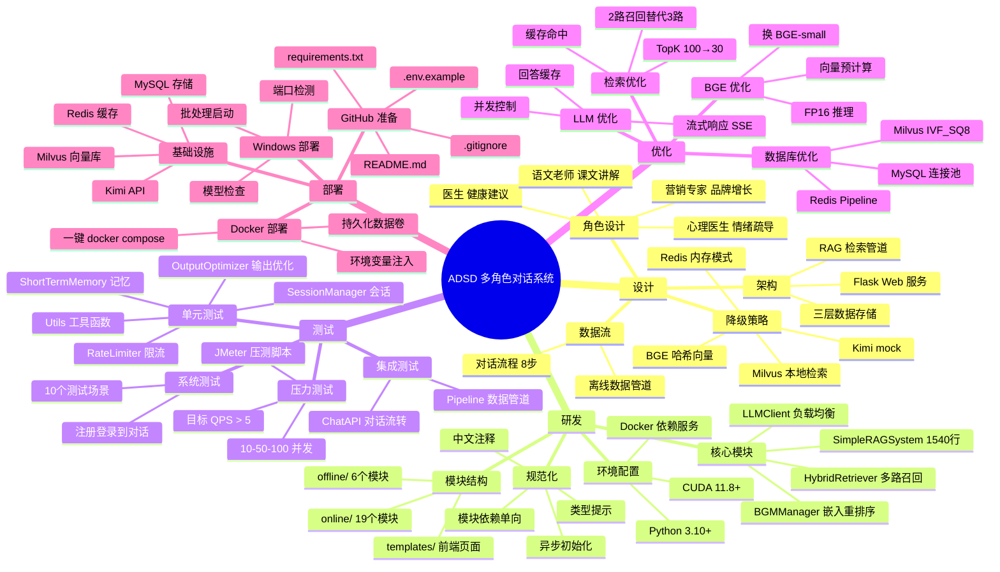

# ADSD 多角色对话系统 — 思维导图



## 大纲文本版

```
1. 设计
   1.1 系统架构
       - Flask Web → RAG 管道 → 数据存储 (MySQL/Redis/Milvus)
   1.2 角色体系
       - 4 种角色，各有系统提示词和知识库
   1.3 核心数据流
       - 对话 8 步：记忆→检索→Prompt→LLM→优化→持久化
       - 离线：PDF→解析→QA生成→向量化→入库
   1.4 降级策略
       - 5 种外部服务不可用时各有兜底方案

2. 研发
   2.1 模块结构 (27 个文件)
       - online/ 19 模块 + offline/ 6 模块 + 前端模板
   2.2 核心类
       - SimpleRAGSystem(1540行): 对话+检索+测试
       - HybridRetriever: BM25+TF-IDF+RRF
       - LLMClient: 多端点+限流+故障转移
       - BGMManager: BGE-M3嵌入+BGE Reranker重排序
   2.3 开发规范
       - 中文注释、类型提示、单向依赖、后台线程初始化

3. 测试
   3.1 单元测试
       - utils / 记忆 / 输出优化 / 会话 / 限流器
   3.2 集成测试
       - 对话 API 完整流转测试
       - 数据管道格式校验
   3.3 系统测试
       - 10 个端到端场景
   3.4 压力测试
       - JMeter：10/50/100 并发
       - 目标：QPS≥5, P95<5s

4. 优化
   4.1 检索优化 (★★☆)
       - 缓存、2路召回、降TopK
   4.2 LLM优化 (★★★★★)
       - 流式响应、回答缓存、并发池
   4.3 BGE优化 (★★★)
       - 预计算、FP16、换小模型
   4.4 数据库优化 (★★)
       - 索引类型、连接池、Pipeline

5. 部署
   5.1 前置依赖
       - Docker 启动 Milvus/Redis/MySQL
       - 下载 BGE 模型到 models/
       - 配置 .env
   5.2 部署方式
       - Docker Compose（推荐）
       - Windows 批处理脚本
       - 纯 Python 开发模式
```
